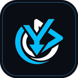

# userytdl

**A sleek YouTube video and audio downloader for Windows.**

Paste a link or search by title, pick your format and quality, and userytdl
handles the rest, wrapped in a pink-and-black liquid glass interface.

---

## Highlights

|  | Feature |
|:--|:--|
| **Paste or search** | Drop in a YouTube link, or search by video title right inside the app and pick from the results. |
| **Any video quality** | 144p up to 4K, in MP4, MKV, or WebM, with or without the audio track. |
| **Any audio format** | MP3, M4A/AAC, Opus, OGG Vorbis, FLAC, ALAC, or WAV, with selectable bitrate. |
| **Playlists** | Point it at a playlist and pull the whole thing in one go. |
| **Download history** | Every past download lives in the History tab: show in folder, redownload, or delete, one click each. |
| **Your defaults, remembered** | Set your preferred quality, format, and save folder once in Settings. |
| **Stays current** | Checks for new versions on launch, with a one-click install when one's ready. |

---

## Installing

1. Grab the latest installer from the [Releases page](https://github.com/iamjrmh/userytdl/releases/latest).
2. Run **userytdl-installer.exe** (or the `.msi`, if you prefer) and follow the prompts.
3. Launch **userytdl** from the Start menu.

Everything userytdl needs to download and convert video is bundled with the app. There's nothing else to install.

---

## Using it

1. Paste a YouTube video or playlist URL into the bar at the top, or tap **Or search by video title** to find it by name.
2. Once it loads, pick **Video** or **Audio only**, choose your quality/format, and confirm where it should save.
3. Hit **Download** and watch its progress in the **Downloads** tab.
4. Head to **History** any time to reopen, redownload, or delete a past download.
5. Head to **Settings** to change your defaults, or to manually check for updates.

---

## A couple of notes

- userytdl needs an internet connection to look up and download videos.
- You're responsible for only downloading content you have the right to download.
- Windows may show a SmartScreen prompt on first run since the installer isn't signed with a paid certificate. Click **More info → Run anyway** to proceed.

---

## Credits

- Mascot **JURMRWEED** by **wormsrule**.
- Powered by [yt-dlp](https://github.com/yt-dlp/yt-dlp).

Built by JURMR.

